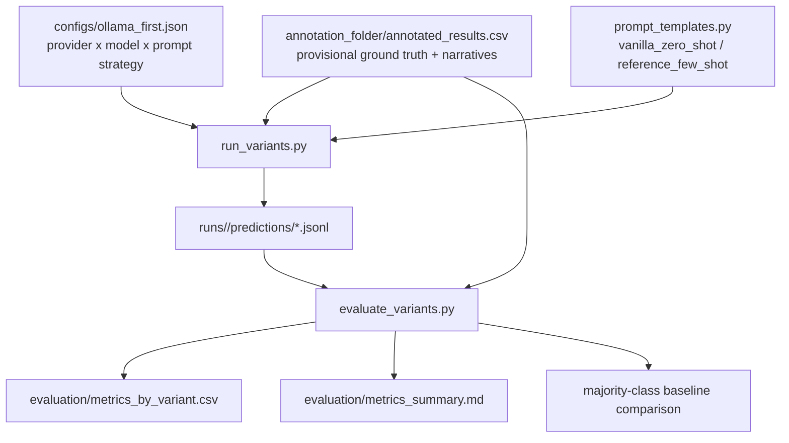
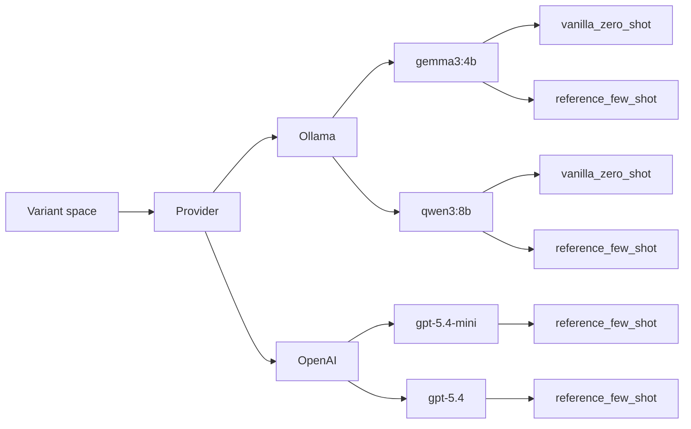

# Inference And Evaluation Pipeline

This folder is the variant-analysis scaffold for the CFPB fraud annotation project. It is intentionally separate from the original `annotation_pipeline.py` so you can run prompt/model comparisons without disturbing the current batch annotation workflow.

For now, treat [`annotation_folder/annotated_results.csv`](/Users/kevin/school/532/project_repo/annotation_folder/annotated_results.csv) as the provisional ground-truth table. Human adjudication is still incomplete, but this lets you compare extractor variants now and swap in reviewed labels later.

## What This Adds

- `run_variants.py`: runs prompt/model/provider variants and writes per-construct predictions.
- `evaluate_variants.py`: scores those predictions against provisional ground truth and adds a majority-class baseline.
- `configs/ollama_first.json`: a starter config with local Ollama variants enabled first and OpenAI variants present but disabled.
- `prompt_templates.py`: two prompt strategies grounded in the current annotation guide and the existing prompt style.

## Mermaid Pipeline



## Mermaid Variant Map



## Default Variant Set

| Variant | Provider | Model | Prompt Strategy | Enabled |
| --- | --- | --- | --- | --- |
| `ollama-gemma3-vanilla` | Ollama | `gemma3:4b` | `vanilla_zero_shot` | Yes |
| `ollama-gemma3-reference` | Ollama | `gemma3:4b` | `reference_few_shot` | Yes |
| `ollama-qwen3-vanilla` | Ollama | `qwen3:8b` | `vanilla_zero_shot` | Yes |
| `ollama-qwen3-reference` | Ollama | `qwen3:8b` | `reference_few_shot` | Yes |
| `openai-gpt-5.4-mini-reference` | OpenAI | `gpt-5.4-mini` | `reference_few_shot` | No |
| `openai-gpt-5.4-reference` | OpenAI | `gpt-5.4` | `reference_few_shot` | No |

Adjust the model tags to match whatever you have actually pulled locally.

## Prompt Strategies

- `vanilla_zero_shot`: short task definition, no worked examples, strict schema output.
- `reference_few_shot`: stronger construct rules, a few worked examples or decision rules, and closer alignment with the current annotation guide plus the original extraction prompt style.

The intent is to isolate two useful axes:

1. Model family / size differences.
2. Prompting quality differences with the same underlying construct schema.

## Quick Start

### 1. Pull local Ollama models

Example:

```bash
ollama pull gemma3:4b
ollama pull qwen3:8b
```

### 2. Run a short smoke pass

```bash
python inference_eval/run_variants.py \
  --config inference_eval/configs/ollama_first.json \
  --limit 5
```

This creates a run folder under `inference_eval/runs/` with:

- `manifest.json`
- `predictions/<variant>.jsonl`

### 3. Evaluate the run

```bash
python inference_eval/evaluate_variants.py \
  --run-dir inference_eval/runs/<timestamp-config-name>
```

This writes:

- `evaluation/metrics_by_variant.csv`
- `evaluation/metrics_summary.md`

## Output Semantics

The runner emits one prediction per `complaint x construct x variant`. That keeps the experiment close to the current annotation process, where constructs are conceptually distinct and differ in difficulty.

The evaluator currently reports:

- `C1`: accuracy on perceived information vulnerability score.
- `C2`: accuracy on absolute-loss code, relative-significance score, and psychological-harm flag, plus exact match on amount strings.
- `C3`: micro precision/recall/F1 for emotion presence, exact-match across all eight emotions, tier accuracy on positive emotions, and inference-pattern accuracy on Tier 2 items.
- `C4`: accuracy on investment engagement score.
- `majority_baseline`: a simple deterministic baseline computed from the current provisional ground truth.

## Ground Truth Assumption

Current assumption:

- [`annotation_folder/annotated_results.csv`](/Users/kevin/school/532/project_repo/annotation_folder/annotated_results.csv) is the stand-in ground truth for evaluation.

Later update path:

- Replace or extend this with reviewed override columns or an adjudicated export once the human review is finished.

## Current API Notes Verified On 2026-03-30

### Ollama

- Ollama’s API docs center local chat generation on [`/api/chat`](https://docs.ollama.com/api/chat).
- Ollama’s structured outputs docs say to pass a JSON schema through the `format` field and note that it also helps to repeat the schema in the prompt: [Structured Outputs](https://docs.ollama.com/capabilities/structured-outputs).
- General API entry point: [Ollama API introduction](https://docs.ollama.com/api/introduction).

### OpenAI

- The current GPT-5.4 model page shows support for `v1/responses`, `v1/batch`, and structured outputs, and lists reasoning effort settings `none`, `low`, `medium`, `high`, `xhigh`: [GPT-5.4 model page](https://developers.openai.com/api/docs/models/gpt-5.4).
- The current structured outputs guide shows the Responses API shape using `text.format` with `type: "json_schema"`: [Structured outputs guide](https://developers.openai.com/api/docs/guides/structured-outputs).
- The migration guide shows the Responses API pattern with `input` and `response.output_text`: [Migrate to Responses](https://developers.openai.com/api/docs/guides/migrate-to-responses).

Those docs are why this scaffold uses:

- Ollama `POST /api/chat` with `format=<json schema>`.
- OpenAI `POST /v1/responses` with `text.format`.

## Suggested Next Steps

1. Run the Ollama variants on `--limit 10` first to see which models actually follow the schemas reliably on your machine.
2. Keep the prompt strategies fixed while swapping models, then keep the model fixed while swapping prompt strategies.
3. After human review is finished, update `build_ground_truth()` so override columns take precedence over provisional labels.
