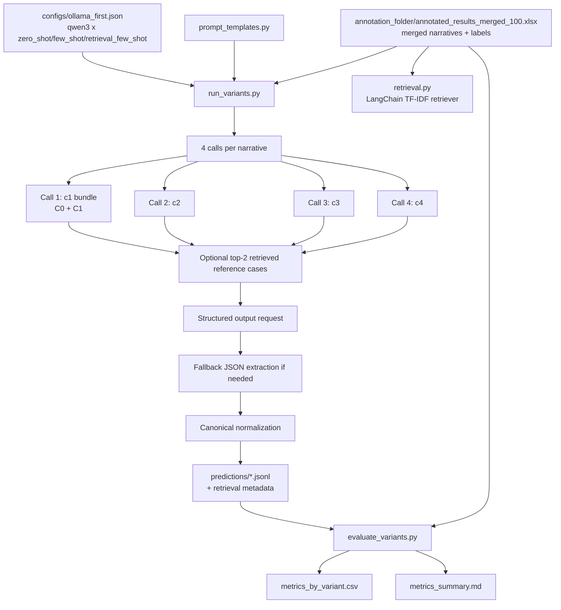
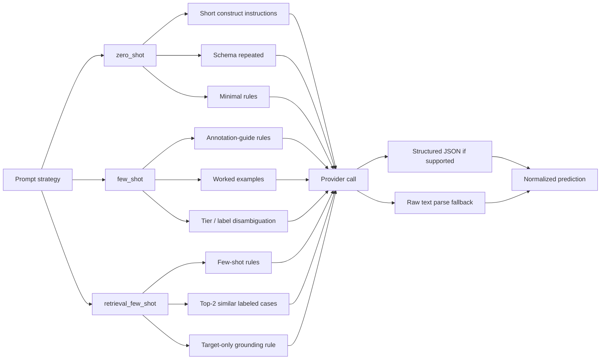

```mermaid
flowchart TD
    A["annotation_folder/annotated_results_merged_100.xlsx<br/>merged narratives + labels"] --> B["run_variants.py"]
    A --> R["retrieval.py<br/>LangChain TF-IDF retriever"]
    C["configs/ollama_first.json<br/>qwen3 x zero_shot/few_shot/retrieval_few_shot"] --> B
    D["prompt_templates.py"] --> B
    B --> E["4 calls per narrative"]
    E --> E1["Call 1: c1 bundle<br/>C0 + C1"]
    E --> E2["Call 2: c2"]
    E --> E3["Call 3: c3"]
    E --> E4["Call 4: c4"]
    E1 --> X["Optional top-2 retrieved reference cases"]
    E2 --> X
    E3 --> X
    E4 --> X
    X --> F["Structured output request"]
    F --> G["Fallback JSON extraction if needed"]
    G --> H["Canonical normalization"]
    H --> I["predictions/*.jsonl<br/>+ retrieval metadata"]
    I --> J["evaluate_variants.py"]
    A --> J
    J --> K["metrics_by_variant.csv"]
    J --> L["metrics_summary.md"]
```

```mermaid
flowchart LR
    A["Prompt strategy"] --> B["zero_shot"]
    A --> C["few_shot"]
    A --> R["retrieval_few_shot"]
    B --> B1["Short construct instructions"]
    B --> B2["Schema repeated"]
    B --> B3["Minimal rules"]
    C --> C1["Annotation-guide rules"]
    C --> C2["Worked examples"]
    C --> C3["Tier / label disambiguation"]
    R --> R1["Few-shot rules"]
    R --> R2["Top-2 similar labeled cases"]
    R --> R3["Target-only grounding rule"]
    B1 --> D["Provider call"]
    B2 --> D
    B3 --> D
    C1 --> D
    C2 --> D
    C3 --> D
    R1 --> D
    R2 --> D
    R3 --> D
    D --> E["Structured JSON if supported"]
    D --> F["Raw text parse fallback"]
    E --> G["Normalized prediction"]
    F --> G
```
