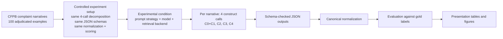

# High-Level Inference Pipeline

Use this on the methodology slide to separate what stays fixed from what changes across conditions.

Key message:
- The dataset, task decomposition, output contracts, and scoring stay constant.
- Only the inference condition changes, so performance differences are attributable to model and prompting choices.
