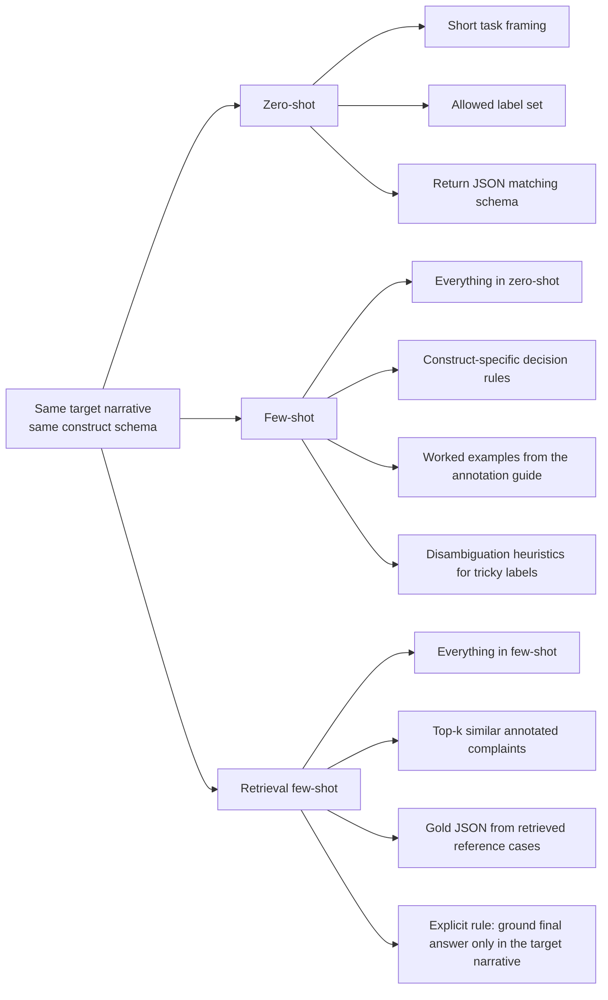

# Prompt Strategy Comparison

Use this on the experiment-design slide to show exactly what each prompt condition adds.

What each strategy entails:
- `Zero-shot`: tests the model with the task definition, label vocabulary, and schema only.
- `Few-shot`: adds richer annotation guidance and hand-authored examples inside the prompt.
- `Retrieval few-shot`: keeps the few-shot scaffold, then injects dynamically retrieved complaint examples and their gold annotations.
