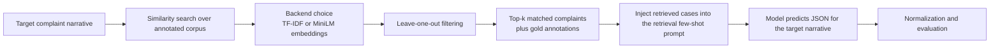

# Retrieval-Augmented Prompting

Use this on the retrieval slide to show the flow without dropping into implementation details.

Retrieval-specific points to say aloud:
- Retrieved examples are analogous references, not labels to copy.
- Leave-one-out retrieval prevents the target complaint from being returned as its own example.
- The retrieval backend is part of the experimental condition, so TF-IDF and MiniLM can be compared directly.
